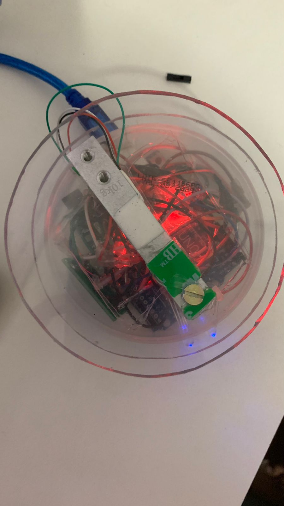
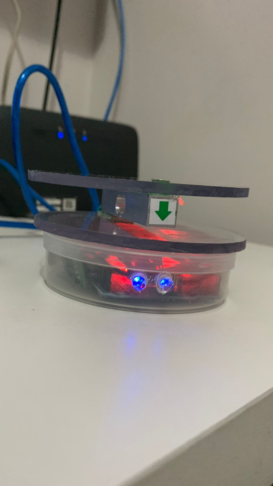

# SUPORTE INTELIGENTE PARA GARRAFA D'ÁGUA
---
## Integrantes
+ João Paulo Silva Moraes
+ Jayron de Brito
+ Mateus Ferreira Trindade
+ Ricciardo Ramalho Rizzo 
+ Thiago Colerato Balreira

## Descrição do projeto

O projeto tem como objetivo desenvolver uma plataforma útil no dia-dia para lembrete de hidratação. Para manter efetivo o projeto utilizaremos alguns mecanismos para o monitoramento do peso, a partir daí com o auxílio de um marcador de tempo faremos um lembrete visual para alertar o usuário da hidratação.

## Motivação

A nossa motivação vem de uma ideia de conscientização à hidratação dos programadores, que por longas jornadas de trabalho acabam esquecendo de se hidratar.

## Materiais Utilizados

Os seguintes materiais foram utilizados:

No protótipo real:
+ Arduino Uno
+ Célula de carga 10Kg 
+ Led RGB
+ Módulo Conversor HX711 para Sensor de Peso
+ placa de prototipagem
+ Jumpers
+ Resistor 330 Ohns
+ Placa acrílica

No protótipo virtual:
+ Arduino Uno
+ Potenciômetro para simular uma célula de carga 
+ Led RGB
+ Placa de prototipagem
+ Jumpers
+ Tela LCD
+ Resistor 220 Ohns

## Imagens do Projeto

**Projeto Real:**

**Projeto no TinkerCad:**

## Resultados
No protótipo virtual o projeto funcionou com a adaptação do potenciômetro para simulação da célula de carga, pois no tinkercad não possui uma célula, o projeto funcionou corretamente.
O protótipo real, teve sucesso, foi possível calibrar a balança corretamente e foi observado que a balança fazia a correta leitura do peso e a contagem dos minutos.

Durante a criação do projeto tivemos alguns problemas na execução. Quando instalado o módulo HX711 e a célula de carga foi observado que ela não estava fazendo uma leitura correta dos materiais, fugindo do esperado, a primeira conclusão para este problema foi de que havia maus contatos entre célula de carga, módulo e Arduino.

Portanto foi completamente refeita as soldas e adaptados os pinos em uma protoboard eliminando os maus contatos e entregando uma leitura esperada para a calibragem da balança. Com isso seguimos com a programação para finalizar a parte da leitura.

### Código fonte do projeto físico

	// INCLUSÃO DE BIBLIOTECAS
	#include <HX711.h>

	// DEFINIÇÕES DE PINOS
	#define pinDT  2
	#define pinSCK  7

	// DEFINIÇÕES
	#define pesoMin 0.010
	#define pesoMax 1.0
	#define escala 0.0f

	// INSTANCIANDO OBJETOS
	HX711 scale;

	// DECLARAÇÃO DE VARIÁVEIS  
	float  pesoencima=0;

	long pesor = 0;
	long pesoa = 0;

	int str = 0; //SERVE COMO CONTADOR INICIAL
	int verm = 12; 
	int azul = 10; 
	int verd = 8; 

	int segundos=0; 
	int minutos=0;
	int estado=0;

	//int contagem=15;

	void setup() {
	 Serial.begin(57600);

	  scale.begin(pinDT, pinSCK); // CONFIGURANDO OS PINOS DA BALANÇA
	  scale.set_scale(208783); // ENVIANDO O VALOR DA ESCALA CALIBRADO

	  delay(2000);
	  scale.tare(); // ZERANDO A BALANÇA PARA DESCONSIDERAR A MASSA DA ESTRUTURA
	  Serial.println("Setup Finalizado!");
	}

	void loop() {

    	scale.power_up(); // LIGANDO O SENSOR
    
	pesoencima = scale.get_units(5); // SALVANDO NA VARIAVEL O VALOR DA MÉDIA DE 5 MEDIDAS
	Serial.println(pesoencima, 3);
	if ( pesoencima <= pesoMin ){ // CONFERE SE A MASSA ESTÁ NA FAIXA VÁLIDA
	scale.tare(); // ZERA A BALANÇA CASO A MASSA SEJA MENOR QUE O VALOR MIN
	pesoencima = 0;
	//Serial.println("Tara Configurada!");
	} else if (  pesoencima >= pesoMax ){
	scale.tare(); // ZERA A BALANÇA CASO A MASSA SEJA MAIOR QUE O VALOR MÁX
	pesoencima = 0;
	Serial.println("Tara Configurada!");
	} else {
	//Serial.println(pesoencima);
	}

    	scale.power_down(); // DESLIGANDO O SENSOR
  
  
	for (int segundos = 0 ; segundos <= 59;segundos ++)
	{
	delay (10);
	}
	if (segundos%60==0)
	{
	minutos++;
	}
	if (minutos%60==0)
	{
	minutos=0;
	}
  
   	if(pesoencima>0.05)
	{ 
  	digitalWrite(verd, HIGH);
 	digitalWrite(verm, LOW);
   	digitalWrite(azul, LOW);
 
    	if ( minutos >5 && str<=0)
	{
        digitalWrite(verd, LOW);
        digitalWrite(verm, HIGH);
        digitalWrite(azul, LOW);   
     	}
    	if ( pesoa<pesoencima && str >0 && minutos > 5){
        digitalWrite(verd, LOW);
        digitalWrite(verm, HIGH);
        digitalWrite(azul, HIGH);
        }
  
    	}
    	else
	{
    	digitalWrite(verd, LOW);
    	digitalWrite(verm, LOW);
    	digitalWrite(azul, HIGH);
      	minutos=0;
 
     	if (minutos >5 && pesoencima>0.02)
	{
     	str++;
     	pesoa=pesor;
 	minutos = 0;
        }
  
    	if (minutos >5 && pesoencima>0.02 && str > 0 )
	{
      	pesoa = pesor;
      	minutos = 0;
      	}  
    	}
	}

	
## Código Fonte	do protótipo virtual
	#include <LiquidCrystal.h>
		
	LiquidCrystal lcd(12, 11, 5, 4, 3, 2);
	int sen= A0;
	long agua = 0;
	int verm = 10;
	int azul = 9;
	int verd = 8;
	int segundos=0;
	int minutos=0;
	int estado=0;
	
	void setup() {
	Serial.begin(9600);
	lcd.begin(16, 2);
	pinMode(12, OUTPUT);
	pinMode(11, INPUT);
	pinMode(9,OUTPUT);
	pinMode(8,OUTPUT);
	pinMode(10,OUTPUT);
	pinMode(A0, INPUT);
	  
	}
	
	void loop() {
	agua=analogRead(sen);
	lcd.setCursor(2,2);
	lcd.print(agua);
	delay(1000);
	lcd.clear();

	if(agua>0){
	for (int segundos = 0 ; segundos <= 59;segundos ++) 
	{
   	delay (10);
    	Serial.println(minutos);
    	}

    	if (segundos%60==0)
    	{
    	minutos++;
    	}
	if (minutos%60==0)
	{
	minutos=0;
	}
	
   	if (minutos<15){
	lcd.print ("temporestante:");
	lcd.print (minutos);
	digitalWrite(verd, HIGH);
	digitalWrite(verm, LOW);
	digitalWrite (azul, LOW);
	}
	
	else if (minutos>=15){ 
	
	lcd.print ("Beba agua");
	digitalWrite(verd, LOW);
	digitalWrite(verm, HIGH);
	digitalWrite(azul, LOW);
	
	}
	Serial.println(minutos);
	delay(100);
	
	}
	else {
	minutos=0;
	lcd.print ("Sem agua");
	digitalWrite(verd, LOW);
	digitalWrite(verm, LOW);
	digitalWrite(azul, HIGH);
	}}		 
