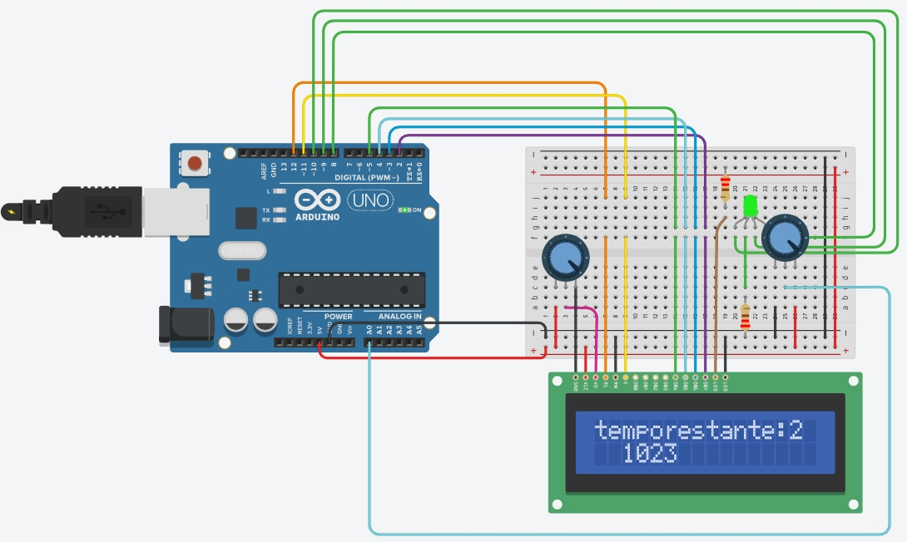

# SUPORTE INTELIGENTE PARA GARRAFA D'ÁGUA
---
## Integrantes
+ João Paulo Silva Moraes
+ Jayron de Brito
+ Mateus Ferreira Trindade
+ Ricciardo Ramalho Rizzo 
+ Thiago Colerato Balreira

## Descrição do projeto

O projeto tem como objetivo desenvolver uma plataforma útil no dia-dia para lembrete de hidratação. Para manter efetivo o projeto utilizaremos alguns mecanismos para o monitoramento do peso, a partir daí com o auxílio de um marcador de tempo faremos um lembrete visual e sonoro para alertar o usuário da hidratação. Para evitar fraudes os lembretes só serão desativados quando a garrafa voltar para a base com o peso menor ou igual ao anterior.

## Motivação

A nossa motivação vem de uma ideia de conscientização à hidratação dos programadores, que por longas jornadas de trabalho acabam esquecendo de se hidratar.

## Materiais Utilizados

Os seguintes materiais foram utilizados:

No protótipo real:
+ Arduino Uno
+ Célula de carga 10Kg 
+ Led RGB
+ Módulo Conversor HX711 para Sensor de Peso
+ placa de prototipagem
+ Jumpers
+ Resistor 330 Ohns
+ Placa acrílica

No protótipo virtual:
+ Arduino Uno
+ Potenciômetro para simular uma célula de carga 
+ Led RGB
+ Placa de prototipagem
+ Jumpers
+ Tela LCD
+ Resistor 220 Ohns

## Imagens do Projeto
**Projeto no TinkerCad:**

**Projeto Real:**

## Resultados
No protótipo virtual o projeto funcionou com a adaptação do potenciômetro para simulação da célula de carga, pois no tinkercad não possui uma célula, o projeto funcionou corretamente.

O protótipo real, teve sucesso, foi possível calibrar a balança corretamente e assim o projeto obteve sucesso, foi observado que a balança fazia a correta leitura do peso e a contagem dos minutos.

## Código Fonte	
	#include <LiquidCrystal.h>
		
		
	LiquidCrystal lcd(12, 11, 5, 4, 3, 2);
	int sen= A0;
	long agua = 0;
	int verm = 10;
	int azul = 9;
	int verd = 8;
	int segundos=0;
	int minutos=0;
	int estado=0;
	
	void setup() {
	Serial.begin(9600);
	lcd.begin(16, 2);
	pinMode(12, OUTPUT);
	pinMode(11, INPUT);
	pinMode(9,OUTPUT);
	pinMode(8,OUTPUT);
	pinMode(10,OUTPUT);
	pinMode(A0, INPUT);
	  
	}
	
	void loop() {
	agua=analogRead(sen);
	lcd.setCursor(2,2);
	lcd.print(agua);
	delay(1000);
	lcd.clear();

	if(agua>0){
	for (int segundos = 0 ; segundos <= 59;segundos ++) 
	{
    delay (10);
    Serial.println(minutos);
    }

    if (segundos%60==0)
    {
    minutos++;
    }
    if (minutos%60==0)
    {
    minutos=0;
    }
	
    if (minutos<15){
	lcd.print ("temporestante:");
	lcd.print (minutos);
	digitalWrite(verd, HIGH);
	digitalWrite(verm, LOW);
	digitalWrite (azul, LOW);
	}
	
	else if (minutos>=15){ 
	
	lcd.print ("Beba agua");
	digitalWrite(verd, LOW);
	digitalWrite(verm, HIGH);
	digitalWrite(azul, LOW);
	
	}
	Serial.println(minutos);
	delay(100);
	
	}
	else {
	minutos=0;
	lcd.print ("Sem agua");
	digitalWrite(verd, LOW);
	digitalWrite(verm, LOW);
	digitalWrite(azul, HIGH);
	}}		 

### Código fonte da calibragem
	// INCLUSÃO DE BIBLIOTECAS
	#include <HX711.h>
	
	// DEFINIÇÕES DE PINOS
	#define pinDT  2
	#define pinSCK  3
	#define pinBotao 4
	
	// INSTANCIANDO OBJETOS
	HX711 scale;
	
	// DECLARAÇÃO DE VARIÁVEIS
	float medida = 0;
	
	void setup() {
	  Serial.begin(57600);
	
	  scale.begin(pinDT, pinSCK); // CONFIGURANDO OS PINOS DA BALANÇA
	  scale.set_scale(); // LIMPANDO O VALOR DA ESCALA
	
	  delay(2000);
	  scale.tare(); // ZERANDO A BALANÇA PARA DESCONSIDERAR A MASSA DA ESTRUTURA
	
	  Serial.println("Balança Zerada");
	}
	
	void loop() {
	
	  medida = scale.get_units(5); // SALVANDO NA VARIAVEL O VALOR DA MÉDIA DE 5 MEDIDAS
	  Serial.println(medida, 3); // ENVIANDO PARA MONITOR SERIAL A MEDIDA COM 3 CASAS DECIMAIS
	
	  scale.power_down(); // DESLIGANDO O SENSOR
	  delay(1000); // AGUARDA 5 SEGUNDOS
	  scale.power_up(); // LIGANDO O SENSOR
	}
...............................................
